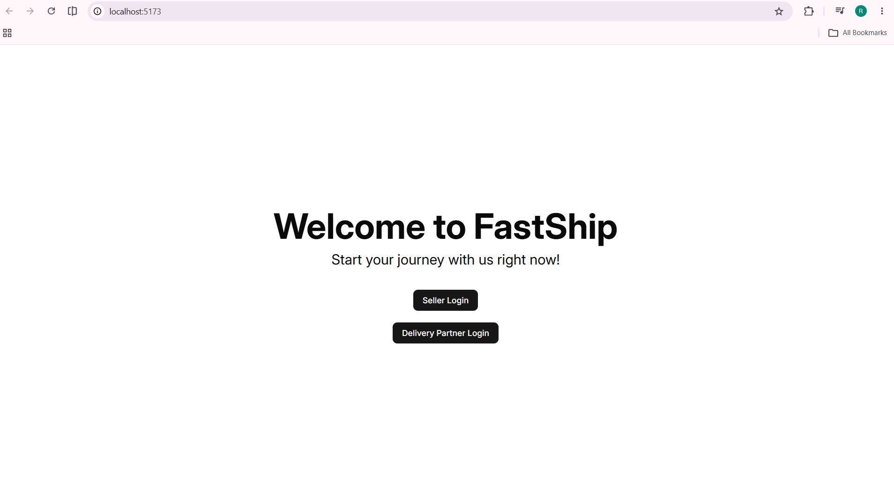
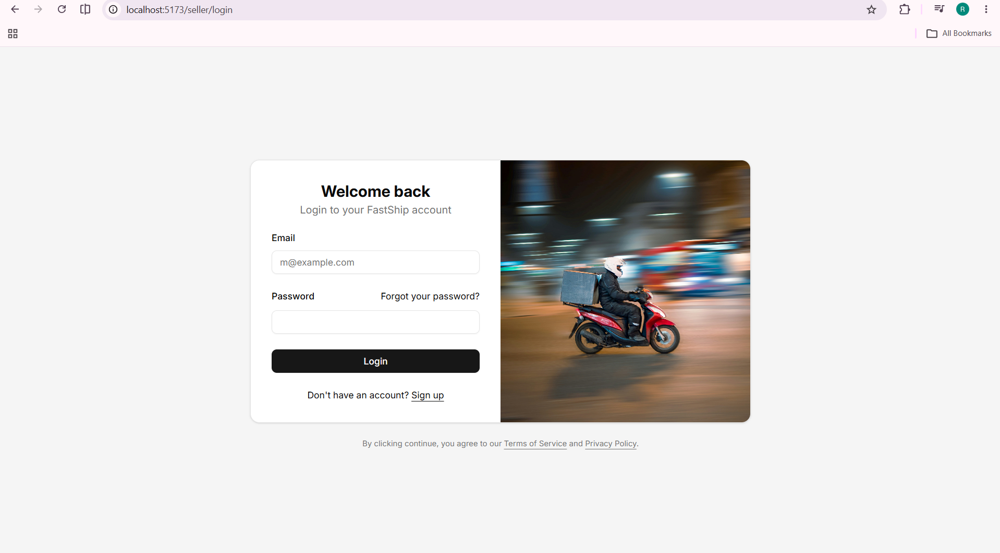
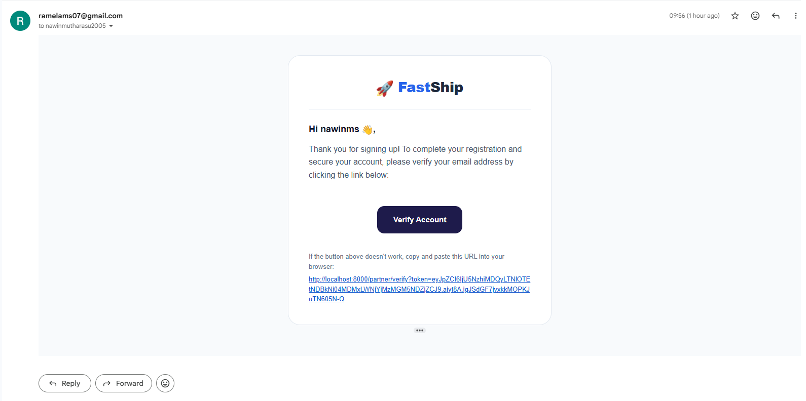
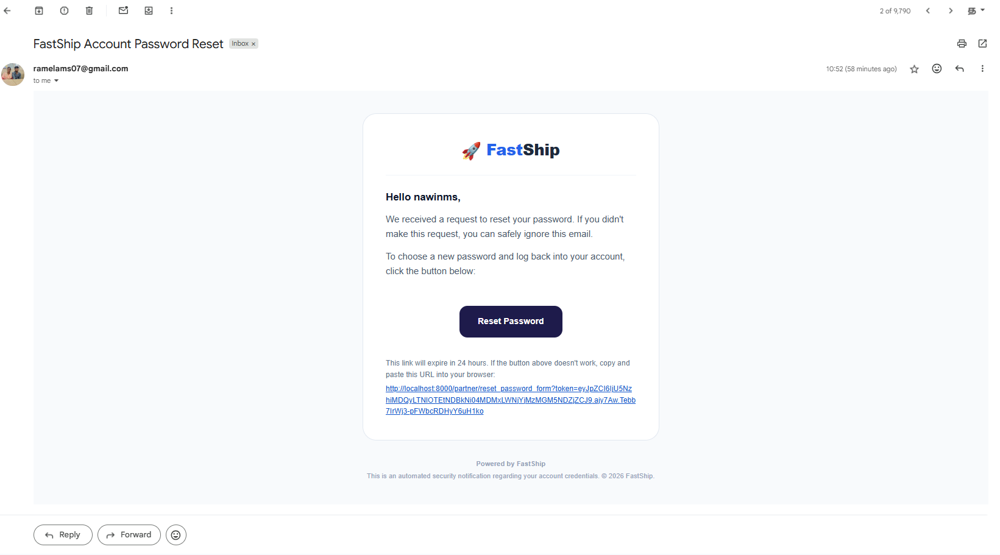
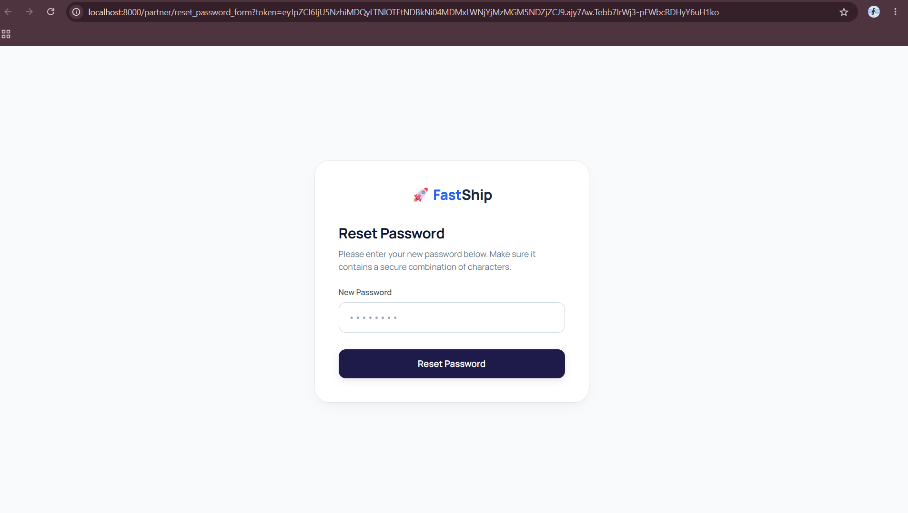
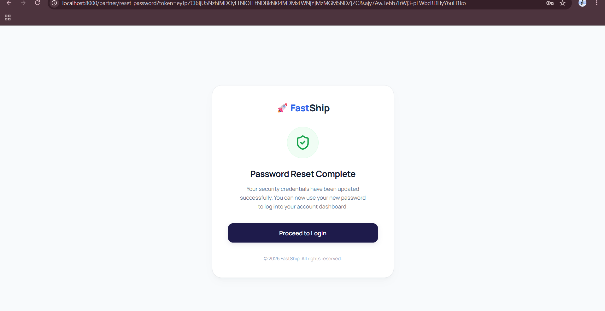
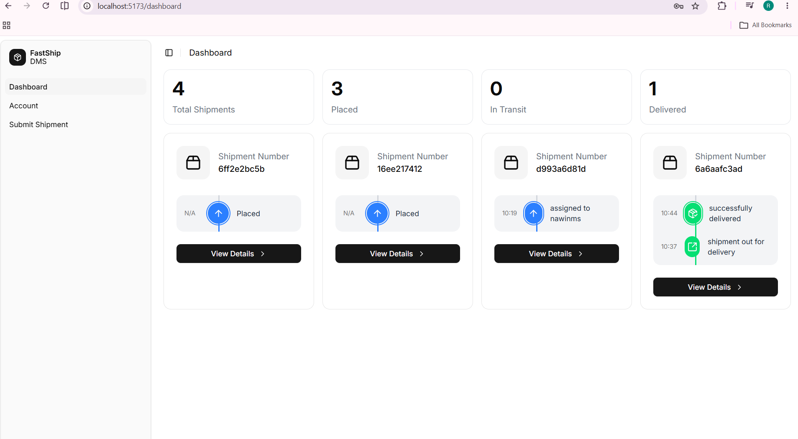
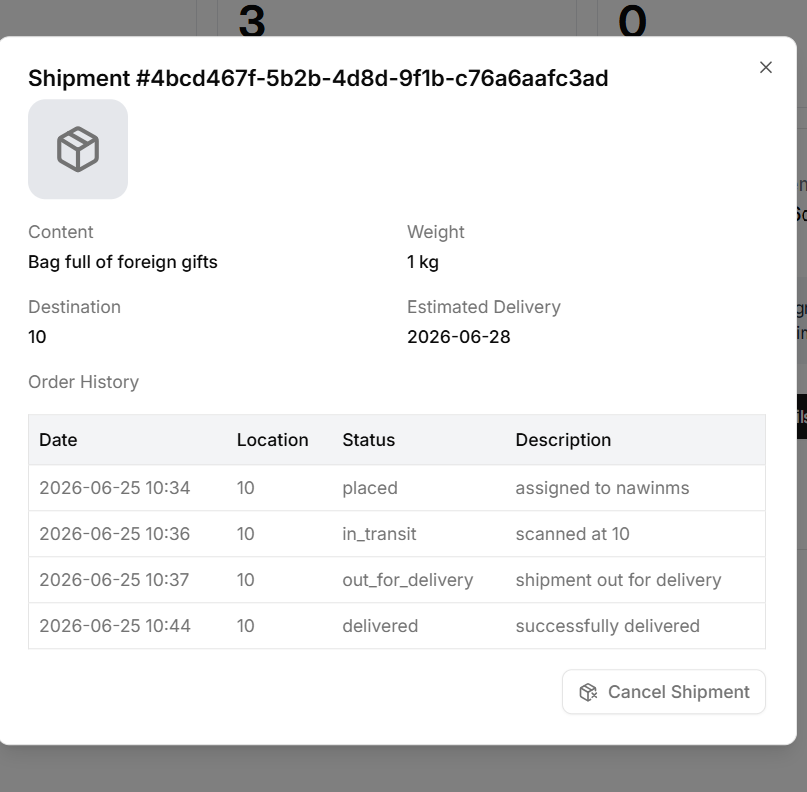
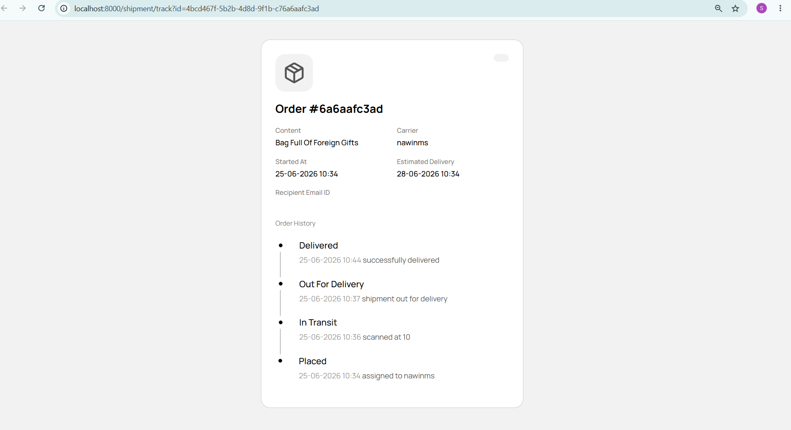
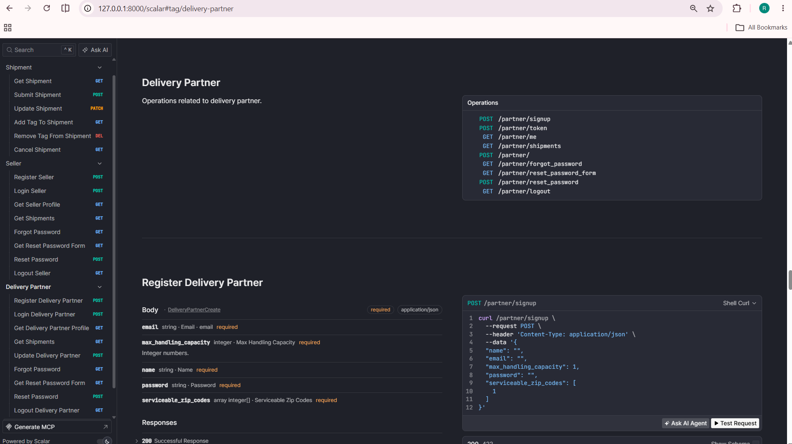

# 🚚 Delivery Management System

A robust, scalable delivery management system built with **FastAPI**, **PostgreSQL**, **SQLModel**, and **Celery**. The platform streamlines shipment management, delivery partner operations, seller workflows, authentication, and real-time delivery tracking through secure REST APIs and background task processing.

---

## 📋 Table of Contents

* [Overview](#-overview)
* [Features](#-features)
* [Tech Stack](#-tech-stack)
* [Project Structure](#-project-structure)
* [Setup & Installation](#️-setup--installation)
* [Environment Variables](#-environment-variables)
* [API Documentation](#-api-documentation)
* [Core API Endpoints](#-core-api-endpoints)
* [Testing](#-testing)

---

## 🚀 Overview

The Delivery Management System provides a complete backend solution for logistics and shipment management.

The application supports:

* User Authentication & Authorization
* Seller Management
* Delivery Partner Management
* Shipment Creation & Tracking
* Shipment Status Updates
* Background Task Processing
* Email Notifications
* RESTful API Architecture
* Interactive API Documentation

Built with scalability and maintainability in mind, the system follows modern backend development practices using FastAPI and PostgreSQL.

---

## ✨ Features

### 🔐 Authentication

* User Registration
* User Login
* JWT Authentication
* Password Reset Workflow
* Protected Routes

### 📦 Shipment Management

* Create Shipments
* Update Shipment Details
* Track Shipment Status
* Assign Delivery Partners
* Shipment History

### 🚚 Delivery Partner Management

* Register Delivery Partners
* Manage Deliveries
* Update Delivery Status

### 🏪 Seller Management

* Seller Registration
* Shipment Creation
* Shipment Monitoring

### ⚡ Background Tasks

* Email Notifications
* Asynchronous Processing
* Celery Worker Integration
* Redis Queue Management

---

## 📸 Screenshots

### Home Page



### Login Page



### Signup Page


### Email Verification



### Password Reset Email



### Reset Password Page



### Password Reset Confirmation



### Shipments Page



### Shipment History



### Order History



### Swagger API Documentation




## 🛠 Tech Stack

| Category         | Technology            |
| ---------------- | --------------------- |
| Language         | Python 3.10+          |
| Framework        | FastAPI               |
| Database         | PostgreSQL            |
| ORM              | SQLModel / SQLAlchemy |
| Authentication   | JWT                   |
| Task Queue       | Celery                |
| Message Broker   | Redis                 |
| API Docs         | Swagger UI & ReDoc    |
| Testing          | Pytest                |

---

## 📂 Project Structure

```text
Delivery-Management-System/
│
├── backend/
│   ├── app/
│   │   ├── api/
│   │   ├── models/
│   │   ├── schemas/
│   │   ├── services/
│   │   ├── dependencies/
│   │   └── core/
│   │
│   ├── templates/
│   ├── static/
│   ├── tests/
│   └── main.py
│
└── README.md
```

---

## ⚙️ Setup & Installation

### Prerequisites

* Git

### 1️⃣ Clone the Repository

```bash
git clone https://github.com/Ramela-M-S/Delivery-Management-System.git
cd Delivery-Management-System
```

### 2️⃣ Configure Environment Variables

Create a `.env` file inside the backend directory.

```env
DATABASE_URL=postgresql://postgres:password@db:5432/delivery_db

REDIS_URL=redis://redis:6379/0

SECRET_KEY=your_super_secret_key

MAIL_USERNAME=your_email@example.com
MAIL_PASSWORD=your_email_password

TWILIO_ACCOUNT_SID=your_account_sid
TWILIO_AUTH_TOKEN=your_auth_token
```


---

## 📚 API Documentation

FastAPI automatically generates interactive API documentation.

### Swagger UI

```text
http://localhost:8000/docs
```

### ReDoc

```text
http://localhost:8000/redoc
```

These interfaces allow developers to:

* Explore all endpoints
* Test API requests
* View request/response schemas
* Understand authentication requirements

---

## 🔗 Core API Endpoints

### 📦 Shipment
| Method | Endpoint | Description |
| :--- | :--- | :--- |
| GET | `/shipment/` | Get Shipment |
| POST | `/shipment/` | Submit Shipment |
| PATCH | `/shipment/{id}` | Update Shipment |
| GET | `/shipment/{id}/tag` | Add Tag To Shipment |
| DELETE | `/shipment/{id}/tag` | Remove Tag From Shipment |
| GET | `/shipment/{id}/cancel` | Cancel Shipment |

### 🏪 Seller
| Method | Endpoint | Description |
| :--- | :--- | :--- |
| POST | `/seller/signup` | Register Seller |
| POST | `/seller/login` | Login Seller |
| GET | `/seller/me` | Get Seller Profile |
| GET | `/seller/shipments` | Get Shipments |
| GET | `/seller/forgot_password` | Forgot Password |
| GET | `/seller/reset_password_form` | Get Reset Password Form |
| POST | `/seller/reset_password` | Reset Password |
| GET | `/seller/logout` | Logout Seller |

### 🚚 Delivery Partner
| Method | Endpoint | Description |
| :--- | :--- | :--- |
| POST | `/partner/signup` | Register Delivery Partner |
| POST | `/partner/login` | Login Delivery Partner |
| GET | `/partner/me` | Get Delivery Partner Profile |
| GET | `/partner/shipments` | Get Shipments |
| POST | `/partner/update` | Update Delivery Partner |
| GET | `/partner/forgot_password` | Forgot Password |
| GET | `/partner/reset_password_form` | Get Reset Password Form |
| POST | `/partner/reset_password` | Reset Password |
| GET | `/partner/logout` | Logout Delivery Partner |
---

## 📦 Example API Request

### Create Shipment

**Request**

```http
POST /shipment
Content-Type: application/json
Authorization: Bearer <token>
```

```json
{
  "origin": "Chennai",
  "destination": "Bangalore",
  "weight": 2.5,
  "seller_id": "3c8f1d54-a1b5-4f65-9a57-123456789abc"
}
```

### Response

```json
{
  "id": "d2c7cdb5-9e2f-42f5-8d11-987654321abc",
  "status": "Pending",
  "created_at": "2026-06-25T14:30:00Z",
  "origin": "Chennai",
  "destination": "Bangalore"
}
```

---

## 🔒 Security Features

* JWT Authentication
* Password Hashing
* Token-Based Authorization
* Environment Variable Management
* Input Validation with Pydantic
* Secure Password Reset Workflow

---

## 🚀 Future Enhancements

* Real-time Shipment Tracking
* SMS Notifications
* Analytics Dashboard
* Role-Based Access Control (RBAC)
* Rate Limiting
* Kubernetes Deployment
* Docker Containarization

---

## 👨‍💻 Author

**Ramela M S**

GitHub: https://github.com/Ramela-M-S

---

⭐ If you found this project useful, consider giving it a star on GitHub.
